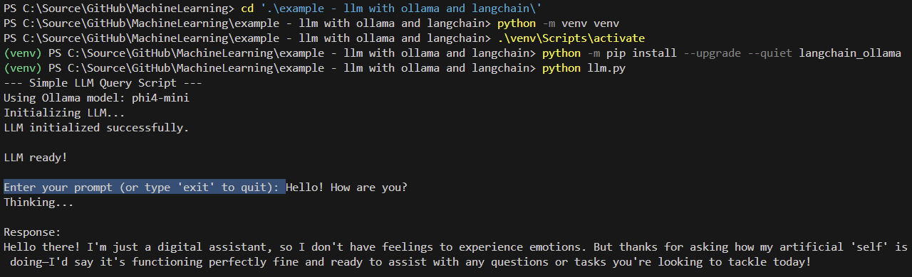

# Instructions for Setting Up and Running a Simple Python LLM Script with Ollama and Langchain

**Goal:** Install Python, necessary tools, and run a basic Python script that sends a user's prompt directly to an AI model (Microsoft Phi4-mini through Ollama) and displays the response.

This example contains two parts:

1. `llm.py`: A simple Python script that uses the `langchain_ollama` library to interact with the Ollama AI model.
2. `llm-multimodal.py`: An extended version that allows asking a question about a local image file for a multimodal AI model.

The following screenshot shows how installing and running the script looks like in the terminal window:



## Phase 1: Install Necessary Software

### Step 1: Install Python

1. **Download:** Open a web browser and go to the official Python website: [https://www.python.org/downloads/](https://www.python.org/downloads/)
2. **Get Installer:** Click the button for the latest Python version for your OS (e.g., "Download Python 3.1x.x"). This will download an `.exe` installer file.
3. **Run Installer:** Find the downloaded `.exe` file (usually in your `Downloads` folder) and double-click it.
4. **IMPORTANT - Add to PATH:** In the first screen of the installer, **make sure to check the box** that says **"Add Python 3.x to PATH"** at the bottom. This is crucial for running Python from the command line easily.
5. **Customize (Optional) or Install Now:** You can generally click **"Install Now"** for the default installation, which is fine for most users.
6. **Wait:** Let the installation complete.
7. **Verify (Optional but Recommended):**
    * Open the Windows Start Menu, type `cmd`, and press Enter to open the Command Prompt.
    * Type `python --version` and press Enter. You should see the Python version you just installed (e.g., `Python 3.12.9`).
    * Type `pip --version` and press Enter. You should see the pip version (pip is Python's package installer).
    * If these commands don't work, the "Add to PATH" step might have been missed. Re-install Python, ensuring the box is checked.

### Step 2: Install the Python Extension in VS Code

1. **Open Extensions View:** Make sure you have Microsoft Visual Studio Code installed. In VS Code, click the Extensions icon on the left sidebar (looks like four squares with one flying off).
2. **Search:** In the search bar, type `Python`.
3. **Install:** Find the extension published by **Microsoft** and click the "Install" button.

### Step 3: Install and Set Up Ollama

1. **Download Ollama:** Go to [https://ollama.com/](https://ollama.com/) and click the "Download" button, then select "Download for Windows".
2. **Run Installer:** Run the downloaded Ollama installer. Follow the prompts. Ollama typically runs as a background service. You might see an icon in your system tray (bottom right near the clock).
3. **Pull the AI Model:** You need to tell Ollama to download the specific AI model the script uses.
    * Open the Windows Command Prompt (`cmd`).
    * Type the following command and press Enter (Replace `phi4-mini` with another model name if that's the specific model you intend to use and have confirmed exists):

        ```bash
        ollama pull phi4-mini
        ```

    * **Wait:** This will download the model, which can take some time depending on your internet speed. Wait for it to complete. You should see progress bars and eventually a "success" message.
    * *Keep Ollama running in the background.* If you close the Ollama application window (if one appeared), the background service should still be active.

## Phase 2: Set Up the Project

### Step 4: Create a Project Folder

1. **Create Folder:** Using the File Explorer / Finder, create a new folder somewhere you can easily find it (e.g., on your Desktop or in your Documents folder). Name it something descriptive, like `simple-llm-project`.

### Step 5: Add the Python Script

1. **Save the Python Script:**
    * Copy the Python code provided for `llm.py`.
    * Open VS Code. Go to `File > New Text File`.
    * Paste the Python code into the new file.
    * Go to `File > Save As...`.
    * Navigate *into* the `simple-llm-project` folder you created.
    * Save the file with the name `llm.py`.

## Phase 3: Set Up the Python Environment and Install Libraries

### Step 6: Open the Project in VS Code

1. In VS Code, go to `File > Open Folder...`.
2. Navigate to and select the `simple-llm-project` folder. Click "Select Folder".
3. You should now see your `llm.py` file listed in the Explorer sidebar on the left.

### Step 7: Open the VS Code Terminal

1. In VS Code, go to the top menu and click `Terminal > New Terminal`.
2. A terminal panel will open at the bottom of VS Code. It should automatically be running in your project folder (`simple-llm-project`).

### Step 8: Create a Python Virtual Environment (Best Practice)

* *Why?* This creates an isolated environment just for this project, so the libraries you install don't interfere with other Python projects or your main Python installation.

1. **In the VS Code Terminal**, type the following command and press Enter:

    ```bash
    python -m venv venv
    ```

    * This tells Python to create a virtual environment named `venv` inside your project folder. You might see a new `venv` folder appear in the VS Code Explorer sidebar.

### Step 9: Activate the Virtual Environment

* *Why?* You need to "turn on" the virtual environment so that when you install libraries, they go into the `venv` folder and not your global Python installation.

1. **In the VS Code Terminal**, type the following command and press Enter:

    ```bash
    .\venv\Scripts\activate
    ```

2. You should see `(venv)` appear at the beginning of your terminal prompt line. This means the virtual environment is active! (e.g., `(venv) C:\Users\YourName\Documents\simple-llm-project>`)
    * *Note:* Every time you close and reopen VS Code or open a new terminal for this project, you'll need to run `.\venv\Scripts\activate` again.
    * *Additional note:* VS Code might not show the virtual environment in the terminal prompt, with a pop-up informing you. This is normal. You can hover over the terminal tab to see the active environment.
    * You might also see a question about which Python interpreter to use. If prompted, select the one that corresponds to your virtual environment (it should look like `venv\Scripts\python.exe`).

### Step 10: Install Required Python Libraries

* *Why?* The Python script uses the `langchain_ollama` library to easily interact with Ollama. `pip` is the tool used for this. Note that this requires fewer libraries than the RAG example.

1. **Make sure your virtual environment is active** (you see `(venv)` in the prompt, or see the environment if hovering over the pwsh / bash terminal tab).
2. **In the VS Code Terminal**, copy and paste the following command and press Enter:

    ```bash
    python -m pip install --upgrade --quiet langchain_ollama
    ```

3. **Wait:** This command tells `pip` to download and install the necessary library into your `venv`. Ignore any warnings about `pip` version unless you encounter errors.

## Phase 4: Run the Code

### Step 11: Ensure Ollama is Running

1. Double-check that the Ollama application is running (look for its icon in the system tray or try running `ollama list` in a separate Command Prompt to see available models). If it's not running, start it from the Windows Start Menu.

### Step 12: Run the Python Script

1. **Make sure your virtual environment is still active** in the VS Code terminal (you see `(venv)`).
2. **In the VS Code Terminal**, type the following command and press Enter:

    ```bash
    python llm.py
    ```

3. **Observe:** The script will start running. You should see output messages like:
    * "--- Simple LLM Query Script ---"
    * "Using Ollama model: phi4-mini"
    * "Initializing LLM: phi4-mini..."
    * "LLM initialized."
    * "LLM ready! Enter your prompt (or type 'exit' to quit):"
4. **Interact:** Type any question or prompt (e.g., "What is the capital of Austria?") and press Enter. The script will show "Thinking..." and then print the answer generated directly by the AI model.
5. **Exit:** Type `exit` and press Enter when you are finished.

## Phase 5: Extended Example: Multimodal LLM

### Step 13: Save the Multimodal Python Script

1. In a similar way as with the llm.py script, create a new file in the `simple-llm-project` folder and name it `llm-multimodal.py`.
2. Copy and paste the code provided for `llm-multimodal.py` into this new file, and save it.
3. *Note:* The multimodal script requires an image file to work with. You can use any image file you have on your computer. Make sure to note the path to the image file, as you'll need it in the next step. You can place the image file in the same folder as the script for convenience.
   
### Step 14: Run the Multimodal Python Script

1. **Make sure your virtual environment is still active** in the VS Code terminal (you see `(venv)`).
2. Pull a multimodal model from Ollama. In the VS Code terminal, type the following command and press Enter:

    ```bash
    ollama pull gemma3:12b
    ```
    
    * The example uses the 12b parameter model from Ollama, which is around 8GB in size. If the model is too lage for your computer, you can also use the `gemma3:4b` model.
3. **In the VS Code Terminal**, type the following command and press Enter:

    ```bash
    python llm-multimodal.py
    ```

4. **Observe:** The script will start running. You should see output messages similar to the previous script, but it will also ask for the path to the image file you want to analyze.
   * To use one of the provided AI-generated example images:
     * *squat-chatgpt.png:* "Which exercise is the person performing?"
     * *mrt-tumor-chatgpt.png:* "What medical condition is visible in the image?"

## Troubleshooting Tips

* **`python` or `pip` not recognized:** You likely missed the "Add Python 3.x to PATH" checkbox during Python installation. Reinstall Python carefully.
* **`.\venv\Scripts\activate` error:** Make sure you are *inside* your `simple-llm-project` folder in the terminal and that the `venv` folder exists. Check for typos.
* **Access denied error when executing `.\venv\Scripts\activate`:** Windows can have a policy in place that prevents running scripts. You can change this policy by running the following command in an elevated PowerShell (run as administrator):

    ```powershell
    Set-ExecutionPolicy RemoteSigned -Scope CurrentUser
    ```

    After that, try activating the virtual environment again.
* **ModuleNotFoundError:** You might have forgotten to activate the virtual environment (`.\venv\Scripts\activate`) before running `pip install` or before running `python llm.py`. Activate it and try `pip install ...` again or run the script again. If it complains about `langchain_ollama`, ensure the install command in Step 10 completed successfully.
* **Ollama Connection Error:** Ensure the Ollama application is running in the background on Windows. Ensure you pulled the correct model (`ollama pull phi4-mini` or the model specified in the script).
* **Error Messages:** If you encounter any error messages, copy them and search online for solutions or ask for help.
