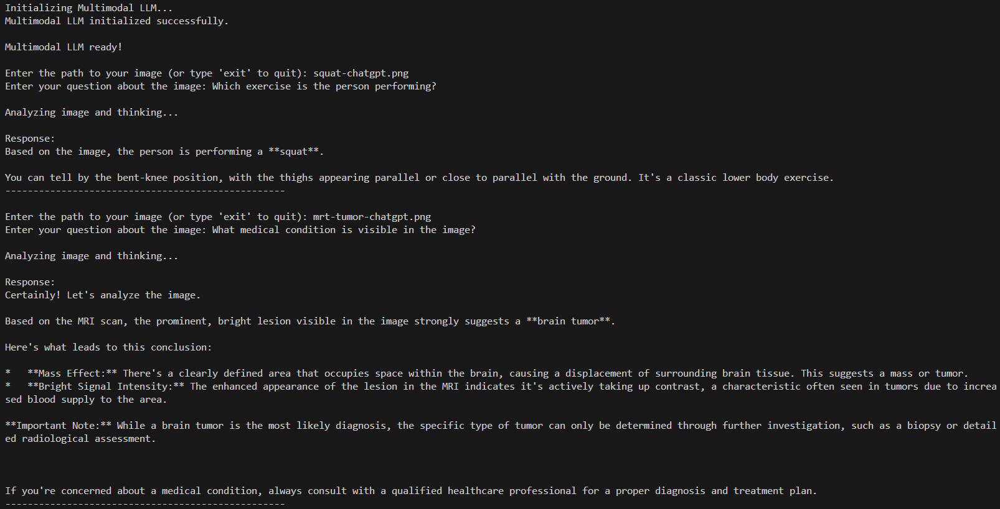

# Run Local Ollama Models with Python and LangChain

This repository contains two small Python examples:

1. `llm.py` sends plain text prompts to a local Ollama model.
2. `llm-multimodal.py` sends an image and a text question to a multimodal Ollama model.

The following screenshot shows the terminal-based workflow:


## Prerequisites

Before you run the scripts, install the following:

1. **Python 3.14 or newer**
   * Download it from [python.org](https://www.python.org/downloads/).
   * On Windows, enable **Add Python to PATH** during installation.
2. **Visual Studio Code**
   * Install the **Python** extension published by Microsoft.
3. **Ollama**
   * Download it from [ollama.com/download](https://ollama.com/download).

## Open the Project

1. Open this repository folder in VS Code.
2. Open a terminal in VS Code with `Terminal > New Terminal`.
3. Make sure the terminal is running in the project root.

## Create and Activate a Virtual Environment

Create the environment:

```bash
python -m venv .venv
```

If `python` does not resolve to Python 3 on your system, use `python3 -m venv .venv` instead.

Activate the environment with the command for your shell and operating system:

| Operating system | Shell | Command |
| --- | --- | --- |
| Windows | PowerShell | `.\.venv\Scripts\Activate.ps1` |
| Windows | Command Prompt | `.\.venv\Scripts\activate.bat` |
| Windows (WSL) | bash | `source .venv/bin/activate` |
| macOS | bash or zsh | `source .venv/bin/activate` |
| Linux | bash or zsh | `source .venv/bin/activate` |

After activation, your prompt usually shows `(.venv)`.

In VS Code, select the interpreter from the virtual environment if prompted. It will usually be one of these:

* Windows: `.venv\Scripts\python.exe`
* macOS, Linux, and WSL: `.venv/bin/python`

## Install the Python Dependencies

With the virtual environment active, run:

```bash
python -m pip install --upgrade pip
python -m pip install -r requirements.txt
```

## Download the Ollama Models

The text example uses `phi4-mini`:

```bash
ollama pull phi4-mini
```

The multimodal example uses `gemma4:e2b`:

```bash
ollama pull gemma4:e2b
```

If you want a smaller multimodal model, choose another image-capable model from the [Ollama library](https://ollama.com/search) and update `OLLAMA_MODEL` in `llm-multimodal.py`.

Make sure Ollama is running before starting either script. You can start it by running the app or manually with:

```bash
ollama serve
```

If Ollama is already running as a background service on your system, you do not need to start it again.

## Run the Text Example

Start the script:

```bash
python llm.py
```

You can then enter prompts such as:

```text
What is the capital of Austria?
```

Type `exit` to quit.

## Run the Multimodal Example

Start the script:

```bash
python llm-multimodal.py
```

The script asks for:

1. A path to an image file.
2. A question about that image.

This repository includes two sample images you can use:

* `./squat-chatgpt.png`
* `./mrt-tumor-chatgpt.png`

Example prompts:

* For `./squat-chatgpt.png`: `Which exercise is the person performing?`
* For `./mrt-tumor-chatgpt.png`: `What medical condition is visible in the image?`

The following screenshot shows a multimodal run:



## Troubleshooting

* **Python command not found:** Try `python3 --version`. On Windows, reinstall Python and enable **Add Python to PATH**.
* **Virtual environment activation fails in PowerShell:** Run PowerShell once with a user-level execution policy that allows local scripts:

  ```powershell
  Set-ExecutionPolicy -Scope CurrentUser RemoteSigned
  ```

* **Module not found errors:** Verify that the virtual environment is active and rerun `python -m pip install -r requirements.txt`.
* **Ollama connection errors:** Ensure Ollama is running and that the model named in the script has been pulled.
* **Model not found:** Run `ollama list` to confirm the installed model names.
