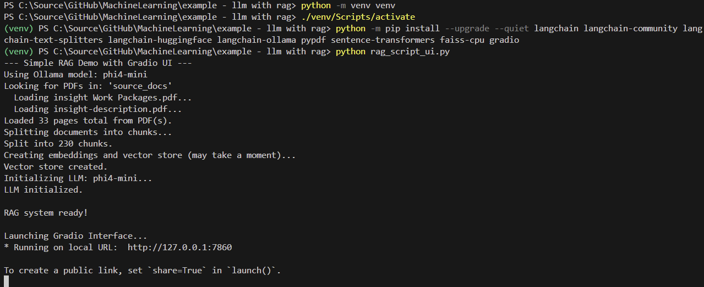

# Instructions for Setting Up a Retrieval-Augmented Generation (RAG) System with Ollama and Langchain

**Goal:** Install Python, necessary tools, and run a specific Python script that interacts with an AI model (Microsoft Phi4-mini through Ollama).

The application can be launched through a terminal:



After running the Python script, you can interact with the RAG system through a web interface (with `rag_script_ui.py`):


## Phase 1: Install Necessary Software

These instructions work on Windows, macOS, and Linux, but a few commands differ by operating system. Wherever that matters, the README now shows the platform-specific command.

### Step 1: Install Python

1. **Install Python 3:** Open [https://www.python.org/downloads/](https://www.python.org/downloads/) and install a current Python 3 release for your operating system.
    * **Windows:** Use the official installer. On the first screen, enable **Add Python to PATH**.
    * **macOS:** Use the official installer from python.org, or install Python 3 with your package manager if you already use one.
    * **Linux:** Install Python 3 and `venv` support using your distribution's package manager if they are not already present.
2. **Verify the installation:** Open a terminal and run the command that matches your platform:

    ```bash
    python --version
    ```

    or, on systems where Python 3 is exposed as `python3`:

    ```bash
    python3 --version
    ```

3. **Verify pip:**

    ```bash
    python -m pip --version
    ```

    or:

    ```bash
    python3 -m pip --version
    ```

4. If Python or pip is not found:
    * **Windows:** Re-run the installer and make sure **Add Python to PATH** is enabled. You might need to restart Windows or open a new terminal after installation.
    * **macOS/Linux:** Make sure Python 3 is installed and available on your shell `PATH`.

### Step 2: Install the Python Extension in VS Code

1. **Open Extensions View:** Make sure you have Microsoft Visual Studio Code installed. In VS Code, click the Extensions icon on the left sidebar (looks like four squares with one flying off).
2. **Search:** In the search bar, type `Python`.
3. **Install:** Find the extension published by **Microsoft** and click the "Install" button.

### Step 3: Install and Set Up Ollama

1. **Install Ollama:** Go to [https://ollama.com/](https://ollama.com/) and install Ollama for your operating system. Follow the instructions on their website.
2. **Start Ollama:** Launch it once so the local service is available.
3. **Pull the AI Model:** Open a terminal and run the following command to download the model used by the scripts:

    ```bash
    ollama pull phi4-mini
    ```

4. **Verify Ollama is ready:**

    ```bash
    ollama list
    ```

    You should see `phi4-mini` in the output after the download finishes.

5. Keep Ollama running in the background while you use the RAG scripts.

## Phase 2: Set Up the Project

### Step 4: Get the Project Files

1. **Download or clone this repository** into a folder you can easily find.
2. Open that extracted or cloned folder in VS Code.

### Step 5: Add Your PDF Files

1. Make sure you have at least one PDF file that contains text for your RAG application.
2. Copy or move your PDF files directly into the `source_docs` folder inside this project.
3. These are the three included Python scripts:
    * `rag_script.py` is the minimal terminal example.
    * `rag_script_complete.py` includes additional error handling.
    * `rag_script_ui.py` provides the Gradio web interface.

## Phase 3: Set Up the Python Environment and Install Libraries

### Step 6: Open the Project in VS Code

1. In VS Code, go to `File > Open Folder...`.
2. Navigate to and select the repository folder. Click "Select Folder".
3. You should now see the Python scripts and the `source_docs` directory in the Explorer sidebar.

### Step 7: Open the VS Code Terminal

1. In VS Code, go to the top menu and click `Terminal > New Terminal`.
2. A terminal panel will open at the bottom of VS Code. It should automatically be running in the project folder.

### Step 8: Create a Python Virtual Environment (Best Practice)

* *Why?* This creates an isolated environment just for this project, so the libraries you install don't interfere with other Python projects or your main Python installation.

1. **In the VS Code Terminal**, create a virtual environment named `.venv`.

    **Windows:**

    ```bash
    python -m venv .venv
    ```

    **macOS / Linux:**

    ```bash
    python3 -m venv .venv
    ```

    If `python3` is not available but `python` points to Python 3, this also works:

    ```bash
    python -m venv .venv
    ```

2. You should see a new `.venv` folder appear in the project.

### Step 9: Activate the Virtual Environment

* *Why?* You need to "turn on" the virtual environment so that when you install libraries, they go into the `.venv` folder and not your global Python installation.

1. **In the VS Code Terminal**, activate the virtual environment with the command for your shell and operating system.

    **Windows PowerShell:**

    ```powershell
    .\.venv\Scripts\Activate.ps1
    ```

    **Windows Command Prompt:**

    ```bat
    .\.venv\Scripts\activate.bat
    ```

    **macOS / Linux (bash, zsh, etc.):**

    ```bash
    source .venv/bin/activate
    ```

2. You should see `(.venv)` appear at the beginning of your terminal prompt. This means the virtual environment is active.
3. Every time you open a new terminal for this project, activate the environment again.
4. If VS Code prompts you to select a Python interpreter, choose the one inside `.venv`.
5. **Windows PowerShell only:** if script execution is blocked, run this once in a PowerShell window and then retry activation:

    ```powershell
    Set-ExecutionPolicy -Scope CurrentUser RemoteSigned
    ```

### Step 10: Install Required Python Libraries

* *Why?* The Python script uses several external libraries (like `langchain`, `ollama`, `pypdf`, etc.) that need to be installed. `pip` is the tool used for this.

1. **Make sure your virtual environment is active** (you see `(.venv)` in the prompt, or VS Code shows that `.venv` is selected as the active interpreter).
2. **In the VS Code Terminal**, copy and paste the following command and press Enter:

    ```bash
    python -m pip install --upgrade pip
    python -m pip install -r requirements.txt
    ```

3. **Wait:** This installs the dependencies listed in the checked-in `requirements.txt`, which is easier to maintain than repeating the package list inside the README.

## Phase 4: Run the Code

### Step 11: Ensure Ollama is Running

1. Double-check that the Ollama service is running:

    ```bash
    ollama list
    ```

2. If that command fails, start Ollama again using the normal method for your operating system.

### Step 12: Run the Python Script

1. **Make sure your virtual environment is still active** in the VS Code terminal (you see `(.venv)`).
2. **In the VS Code Terminal**, run one of the included scripts. For the minimal terminal example:

    ```bash
    python rag_script.py
    ```

3. **Observe:** The script will start running. You should see output messages like:
    * "Loading document..."
    * "Splitting document..."
    * "Initializing embedding model..."
    * "Creating vector store..." (This might take a moment the first time)
    * "Initializing Ollama LLM..."
    * "RAG system ready!"
    * "Enter your question (or type 'exit' to quit):"
4. **Interact:** Type a question related to the content of the PDF files you provided and press Enter. The script will show "Thinking..." and then print the answer generated by the AI based on the PDF content.
5. **Exit:** Type `exit` and press Enter when you are finished.

## Phase 5: User Interface

### Step 13: Gradio Is Already Included

1. You do **not** need to install Gradio separately if you already ran:

    ```bash
    python -m pip install -r requirements.txt
    ```

2. You also do **not** need to modify the code manually. The repository already includes a ready-to-run Gradio example in `rag_script_ui.py`.

### Step 14: Run the Web UI

1. Start the UI with:

    ```bash
    python rag_script_ui.py
    ```

2. Wait for Gradio to print a local URL in the terminal.
3. Open that URL in your browser if it does not open automatically.
4. Ask questions about the PDFs in `source_docs`.

## Troubleshooting Tips

* **`python`, `python3`, or `pip` not recognized:** Verify that Python 3 is installed and on your `PATH`. On Windows, re-run the installer with **Add Python to PATH** enabled. On macOS/Linux, verify whether your system uses `python3` instead of `python`.
* **Virtual environment activation error:** Make sure you are in the project root and that the `.venv` folder exists. Use the activation command for your operating system and shell.
* **PowerShell activation blocked:** Run `Set-ExecutionPolicy -Scope CurrentUser RemoteSigned` once, then retry `./.venv/Scripts/Activate.ps1`.
* **ModuleNotFoundError:** Activate the virtual environment and rerun `python -m pip install -r requirements.txt`.
* **Ollama connection error:** Ensure the Ollama service is running and that `ollama list` works. Also confirm that `phi4-mini` was downloaded successfully.
* **PDF not found or no PDFs loaded:** Make sure your `.pdf` files are directly inside the `source_docs` folder. The scripts look in the `SOURCE_DIRECTORY = "source_docs"` folder.
* **Slow Performance:** The first run might be slow as it initializes the model and vector store. Subsequent runs should be faster. If it remains slow, check your system resources (CPU, RAM) and close unnecessary applications.
* **Dependency build or wheel errors on very new Python versions:** If an ML dependency does not yet provide a wheel for your Python version, recreate the virtual environment with Python 3.12 or 3.13 and reinstall from `requirements.txt`.
* **Error Messages:** If you encounter an error message, copy the full traceback and the command you ran. That usually makes the issue much faster to diagnose.
