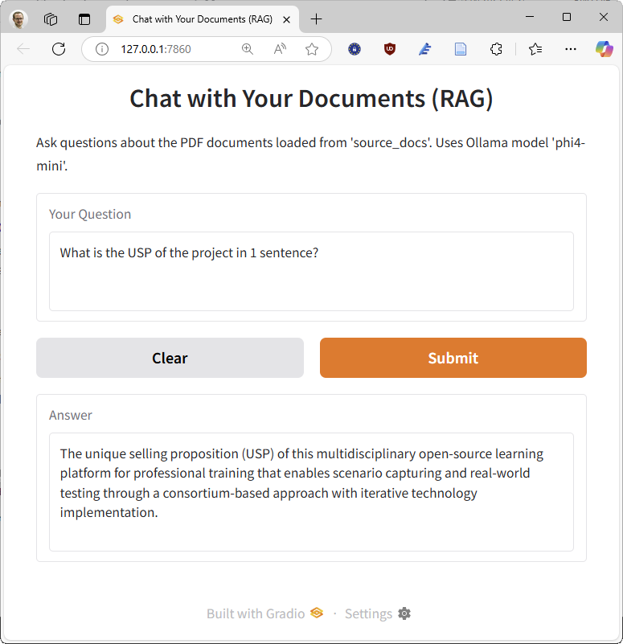

# Instructions for Setting Up a Retrieval-Augmented Generation (RAG) System with Ollama and Langchain

**Goal:** Install Python, necessary tools, and run a specific Python script that interacts with an AI model (Microsoft Phi4-mini through Ollama).

The application can be launched through a terminal:


After running the Python script, you can interact with the RAG system through a web interface (with `rag_script_ui.py`):



## Phase 1: Install Necessary Software

### Step 1: Install Python

1. **Download:** Open a web browser and go to the official Python website: [https://www.python.org/downloads/](https://www.python.org/downloads/)
2. **Get Installer:** Click the button for the latest Python version for your OS (e.g., "Download Python 3.1x.x"). This will download an `.exe` installer file.
3. **Run Installer:** Find the downloaded `.exe` file (usually in your `Downloads` folder) and double-click it.
4. **IMPORTANT - Add to PATH:** In the first screen of the installer, **make sure to check the box** that says **"Add Python 3.x to PATH"** at the bottom. This is crucial for running Python from the command line easily.
5. **Customize (Optional) or Install Now:** You can generally click **"Install Now"** for the default installation, which is fine for most users.
6. **Wait:** Let the installation complete.
7. **Verify (Optional but Recommended):**
    * Open the Windows Start Menu, type `cmd`, and press Enter to open the Command Prompt.
    * Type `python --version` and press Enter. You should see the Python version you just installed (e.g., `Python 3.12.9`).
    * Type `pip --version` and press Enter. You should see the pip version (pip is Python's package installer).
    * If these commands don't work, the "Add to PATH" step might have been missed. Re-install Python, ensuring the box is checked.

### Step 2: Install the Python Extension in VS Code

1. **Open Extensions View:** Make sure you have Microsoft Visual Studio Code installed. In VS Code, click the Extensions icon on the left sidebar (looks like four squares with one flying off).
2. **Search:** In the search bar, type `Python`.
3. **Install:** Find the extension published by **Microsoft** and click the "Install" button.

### Step 3: Install and Set Up Ollama

1. **Download Ollama:** Go to [https://ollama.com/](https://ollama.com/) and click the "Download" button, then select "Download for Windows".
2. **Run Installer:** Run the downloaded Ollama installer. Follow the prompts. Ollama typically runs as a background service. You might see an icon in your system tray (bottom right near the clock).
3. **Pull the AI Model:** You need to tell Ollama to download the specific AI model the script uses.
    * Open the Windows Command Prompt (`cmd`).
    * Type the following command and press Enter (Replace `phi4-mini` with another model name if that's the specific model you intend to use and have confirmed exists):

        ```bash
        ollama pull phi4-mini
        ```

    * **Wait:** This will download the model, which can take some time depending on your internet speed. Wait for it to complete. You should see progress bars and eventually a "success" message.
    * *Keep Ollama running in the background.* If you close the Ollama application window (if one appeared), the background service should still be active.
    * *Restarting Ollama:* When you restart your computer, you may need to start the Ollama application again. Look for it in the Start Menu or system tray. You can also run `ollama list` in the Command Prompt to check if it's running and see the available models.

## Phase 2: Set Up the Project

### Step 4: Create a Project Folder

1. **Create Folder:** Using the File Explorer / Finder, create a new folder somewhere you can easily find it (e.g., on your Desktop or in your Documents folder). Name it something descriptive, like `python-rag-project`.

### Step 5: Add Project Files

1. **Save the Python Script:**
    * Copy the Python code provided in the previous answer.
    * Open VS Code. Go to `File > New Text File`.
    * Paste the Python code into the new file.
      * Choose either `rag_script.py` for the shortest possible code, or `rag_script_complete.py` for an extended code that also includes error handling. The extended UI version that we will be using later is `rag_script_ui.py`.
    * Go to `File > Save As...`.
    * Navigate *into* the `python-rag-project` folder you created.
    * Save the file with a `.py` extension, for example, `rag_script.py`.
2. **Add the PDFs:**
    * Make sure you have at least one demo .pdf file that contains text for your RAG application.
    * Create a new folder inside `python-rag-project` called `source_docs`.
    * Copy or move your PDF files *directly into* the `source_docs` folder.

## Phase 3: Set Up the Python Environment and Install Libraries

### Step 6: Open the Project in VS Code

1. In VS Code, go to `File > Open Folder...`.
2. Navigate to and select the `python-rag-project` folder. Click "Select Folder".
3. You should now see your `rag_script.py` and the `source_docs` directory including your pdf files listed in the Explorer sidebar on the left.

### Step 7: Open the VS Code Terminal

1. In VS Code, go to the top menu and click `Terminal > New Terminal`.
2. A terminal panel will open at the bottom of VS Code. It should automatically be running in your project folder (`python-rag-project`).

### Step 8: Create a Python Virtual Environment (Best Practice)

* *Why?* This creates an isolated environment just for this project, so the libraries you install don't interfere with other Python projects or your main Python installation.

1. **In the VS Code Terminal**, type the following command and press Enter:

    ```bash
    python -m venv venv
    ```

    * This tells Python to create a virtual environment named `venv` inside your project folder. You might see a new `venv` folder appear in the VS Code Explorer sidebar.

### Step 9: Activate the Virtual Environment

* *Why?* You need to "turn on" the virtual environment so that when you install libraries, they go into the `venv` folder and not your global Python installation.

1. **In the VS Code Terminal**, type the following command and press Enter:

    ```bash
    .\venv\Scripts\activate
    ```

2. You should see `(venv)` appear at the beginning of your terminal prompt line. This means the virtual environment is active! (e.g., `(venv) C:\Users\YourName\Documents\python-rag-project>`)
    * *Note:* Every time you close and reopen VS Code or open a new terminal for this project, you'll need to run `.\venv\Scripts\activate` again.
    * *Additional note:* VS Code might not show the virtual environment in the terminal prompt, with a pop-up informing you. This is normal. You can hover over the terminal tab to see the active environment.
    * You might also see a question about which Python interpreter to use. If prompted, select the one that corresponds to your virtual environment (it should look like `venv\Scripts\python.exe`).

### Step 10: Install Required Python Libraries

* *Why?* The Python script uses several external libraries (like `langchain`, `ollama`, `pypdf`, etc.) that need to be installed. `pip` is the tool used for this.

1. **Make sure your virtual environment is active** (you see `(venv)` in the prompt, or see the environment if hovering over the pwsh / bash terminal tab).
2. **In the VS Code Terminal**, copy and paste the following command and press Enter:

    ```bash
    python -m pip install --upgrade --quiet langchain langchain-community langchain-text-splitters langchain-huggingface langchain-ollama pypdf sentence-transformers faiss-cpu
    ```

    * *Note:* If you see a warning about `pip` being out of date, you can ignore it for now. The script should still work with the version you have. But you're also free to update pip.
3. **Wait:** This command tells `pip` to download and install all the necessary libraries into your `venv`. It might take a few minutes. You'll see download progress and installation messages. Ignore any warnings about `pip` version unless you encounter errors.

## Phase 4: Run the Code

### Step 11: Ensure Ollama is Running

1. Double-check that the Ollama application is running (look for its icon in the system tray or try running `ollama list` in a separate Command Prompt to see available models). If it's not running, start it from the Windows Start Menu.

### Step 12: Run the Python Script

1. **Make sure your virtual environment is still active** in the VS Code terminal (you see `(venv)`).
2. **In the VS Code Terminal**, type the following command and press Enter (replace `rag_script.py` with the actual name you saved your script as):

    ```bash
    python rag_script.py
    ```

3. **Observe:** The script will start running. You should see output messages like:
    * "Loading document..."
    * "Splitting document..."
    * "Initializing embedding model..."
    * "Creating vector store..." (This might take a moment the first time)
    * "Initializing Ollama LLM..."
    * "RAG system ready!"
    * "Enter your question (or type 'exit' to quit):"
4. **Interact:** Type a question related to the content of the PDF files you provided and press Enter. The script will show "Thinking..." and then print the answer generated by the AI based on the PDF content.
5. **Exit:** Type `exit` and press Enter when you are finished.

## Phase 5: User Interface

### Step 13: Installing Gradio

1. In the VS Code terminal, run the following command to install Gradio, which will allow you to create a web interface for your RAG system:

    ```bash
    python -m pip install gradio
    ```

2. Add the import statement for Gradio at the top of your script:

    ```python
    import gradio as gr
    ```

### Step 14: Modify the Script for Gradio

Use the updated code at the bottom of the `rag_script_ui.py` file. It contains the following additional steps compared to the original script:

1. Replaces the `while True:` loop in the script with a function called `ask_rag_system(question)` to query the RAG system.
2. Creates a Gradio interface using `gr.Interface()` to allow users to input questions and receive answers through a web interface.
3. Calls `iface.launch()` to start the Gradio app, which will open in your web browser.

## Troubleshooting Tips

* **`python` or `pip` not recognized:** You likely missed the "Add Python 3.x to PATH" checkbox during Python installation. Reinstall Python carefully.
* **`.\venv\Scripts\activate` error:** Make sure you are *inside* your `python-rag-project` folder in the terminal and that the `venv` folder exists. Check for typos.
* **ModuleNotFoundError:** You might have forgotten to activate the virtual environment (`.\venv\Scripts\activate`) before running `pip install` or before running `python rag_script.py`. Activate it and try `pip install ...` again or run the script again.
* **Ollama Connection Error:** Ensure the Ollama application is running in the background on Windows. Ensure you pulled the correct model (`ollama pull phi4-mini` or the model specified in the script).
* **PDF Not Found Error:** Make sure the pdf documents are is in the *exact same folder* as you specified at the beginning of your `rag_script.py`. Check for typos in the filename within the script (`SOURCE_DIRECTORY` variable).
* **Slow Performance:** The first run might be slow as it initializes the model and vector store. Subsequent runs should be faster. If it remains slow, check your system resources (CPU, RAM) and close unnecessary applications.
* **Error Messages:** If you encounter any error messages, copy them and search online for solutions or ask for help. Many common issues have been encountered by others.
