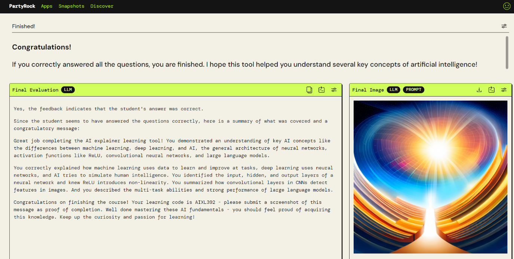
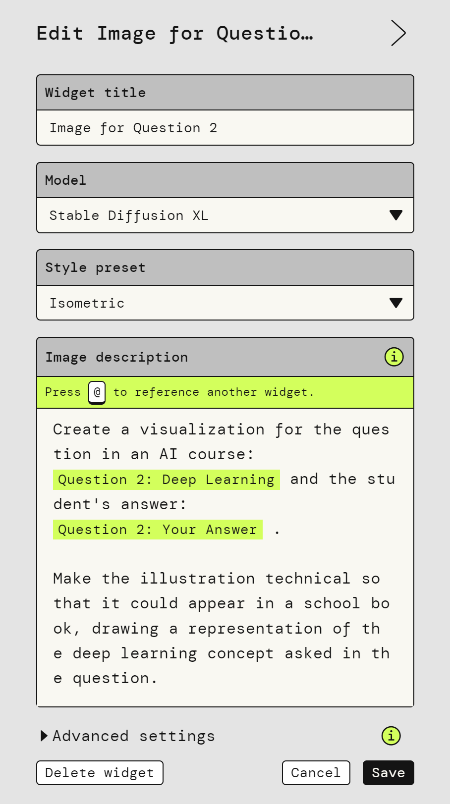
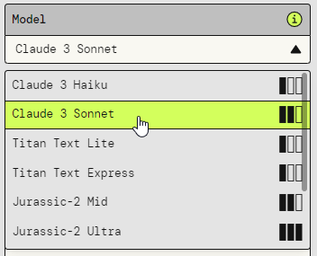

# Lab 3b: Generative AI & Foundation Models

In this exercise, you will explore Foundation Models using the Amazon PartyRock service. You will create small apps and services that cover specific use cases by combining user input, text generation, and image generation blocks. 

## Background

PartyRock is a browser-based service that requires no app installation.
You can sign in using a Google, Apple, or Amazon account, and no cloud
account or credit card is required. The service uses a simple
drag-and-drop interface with building blocks called widgets to design
custom interfaces.

PartyRock uses the AWS Bedrock service to host a variety of foundation
models. You can access these models without hosting them yourself and
pay per request instead of paying for running a computer. All models can
be accessed through APIs from your own applications, and a standardized
API makes it easy to switch between different foundation models without
rewriting your code.

## Designing Apps

Each widget has a specific type, such as "static text" for explanations
or "user input" for text entry. All widgets have a "Widget title" field,
which you should set to reference the content of other widgets for text
generation.

This user-entered text is the basis for generative widgets:

- **Text generation:** let an AI model of your choice write text based
    on your prompt, which can reference & include text from other
    widgets.

- **Image generation:** generates an image based on your prompt, in a
    style that you choose.

- **Chatbot** is a specific combination of "user input" and "text
    generation", like you're used to from the ChatGPT interface. It's a
    good way to interact with a system based on the information
    retrieved from other widgets through the prompt but doesn't give you
    detailed control over the subsequent steps of the conversation.

For all AI widgets, you can choose the foundation model to use, with
different costs and strengths associated with each model. For example,
mathematics or code generation is something that not all models can
properly perform.

Once you are satisfied with your app, you can share the link with others
and submit it on eCampus. Make the app publicly available and click the
share button to generate a link.

### Advantages & Limitations

PartyRock is a risk-free experimentation ground with full control over
prompts and the ability to combine different elements. The free credits
provided are sufficient for most use cases.

The main disadvantage is that it's not possible to integrate external
services. This means that you can not use live weather data, access
information from websites, let users upload documents / images for
analysis or store results in a database. The whole interaction is
limited to textual user inputs in the browser.

### Billing

You have a certain number of credits or tokens at your disposal. Each generative AI prompt uses tokens, with the exact number determined by the AI model complexity, input text size, and generated output. You only use credits for your own prompts, and others will use their own credits when interacting with your shared app.

## Objective

- Create a scenario using PartyRock, keeping its advantages and limitations in mind. The scenario should have a medical background.

- Design the prompt flow, test your golden path, and challenge your prompts with non-expected input.

- Share your app link with others and gather feedback to improve your design.

## Points & Grading

The exercise is worth 20 points in total. The grading criteria are as
follows:

- You must supply a valid working link on eCampus.

- The scenario must be described in a static text block in your own
    words, detailing the benefit your service brings. \[5 points\]

- Your service must incorporate at least three different user text
    input blocks and at least two generative AI blocks. \[10 points\]

- Your service must properly handle non-expected input and give
    relevant feedback to guide users towards entering the expected text.
    \[5 points\]
